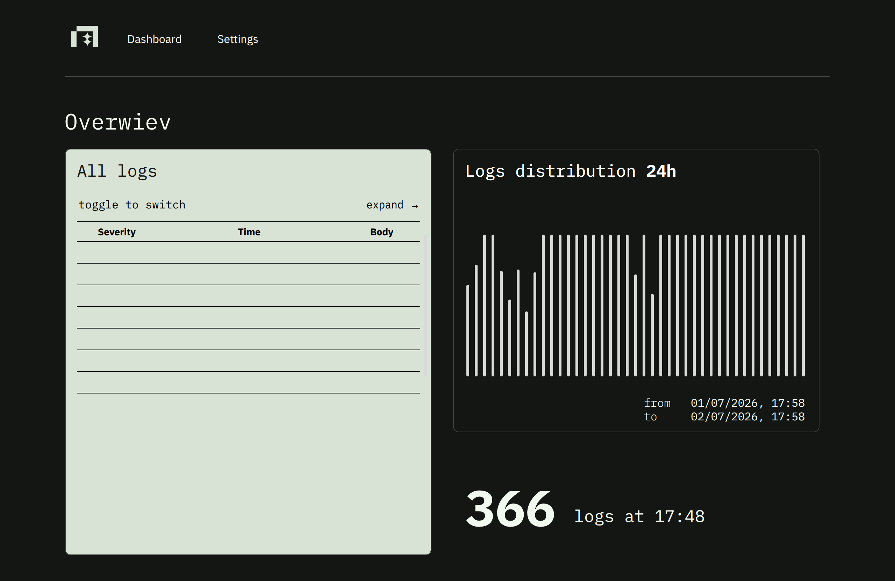

# Neatlogs

An OTLP log viewer: view logs in a table, see the log distribution over the
last 24 hours, and group logs by service.

**Live demo:** [neatlog.vercel.app](https://neatlog.vercel.app)

## How to run

Prerequisites: Node.js 20.9+ and npm.

```bash
# install dependencies
npm install

# start the dev server
npm run dev
```

Open [http://localhost:3000](http://localhost:3000) in your browser.

### Production build

```bash
npm run build
npm run start
```

### Other scripts

```bash
npm run lint      # ESLint
npm run test      # Vitest (unit tests)
npx tsc --noEmit  # type check
```

## Data source

The app fetches OTLP log data from:

```
GET https://take-home-assignment-otlp-logs-api.vercel.app/api/v2/logs
```

The endpoint returns random mock data on every request, so each page load shows
a fresh snapshot.


## Process

### First step (1 hour)

The first thing I did was understand the requirements. To do that I analyzed
the data coming from the API, to understand what we were talking about.

I then imagined a user persona that could use this — I recycled the user
persona I wrote and researched for the
[Dash0 onboarding](https://app.notion.com/p/Persona-Alex-389d996e1dea809294cbe521c4a7a230?source=copy_link).

Based on the persona I sketched a wireframe:



I also designed the Neatlogs logo!
I took this oppurtunity to try out Penpot and I used oklch because, after my talk at CSS Day telling people to use it more,
I would be a buffoon if I didn't use it :-D

### Second step: scaffolding (1.5 hours)

Tech stack I chose:

- Next.js (latest) + React (latest)
- D3.js (only the math functions)
- Zustand for the store
- No need for a DB, so no ORM like Drizzle

### Architecture

I mainly took inspiration from my own experience and from
[this article](https://www.robinwieruch.de/react-folder-structure/) by Robin
Wieruch. I organized the project so it could easily scale and grow, so yes, it
might look a bit odd given there is only one feature right now, but I built it
with the idea that it could grow. Reusable components that could serve other
features live in `src/components`, while feature-specific components live in
`src/features/<feature-name>`.

I like to write components as dumb as possible, relegating logic elsewhere:
the really heavy lifting is done server-side in
`src/features/dashboard-logs/api`

For the chart: the heavy lifting is done on the backend, which already returns
the data formatted the way the frontend needs it, so the FE stays light. React
renders the DOM while D3 handles only the math. D3 never touches the DOM.
When two libraries both want to control the DOM, only one of them should, and
here that's React. For this take-home I deliberately didn't use my own charting
library ([wanigraf](https://wanigraf.com)), so you can see how I think about
charts as well. React rendering the SVG is fine because this chart isn't heavy;
for a more performance-heavy chart I would render to canvas with D3 doing the
math.

The next step was writing an accurate CLAUDE.md with all my choices: how I
wanted the code written, and the architecture. Then I let Claude cook. I
also wrote a harness and an objective so the LLM could check whether it was
doing things correctly.

After Claude was done, I reviewed the code and had Codex (ChatGPT) review it as
well.

The next step was writing the algorithms to shape the data.

### Algorithms (1 hour)

I hand-wrote `flattenLogs` and `clusterLogsByHour` in `transform.ts`. Given the
time constraint I delegated the grouping to Claude, since the JSON was already
more or less grouped — I figured you'd want to see how I think in the other
two.
- flattenLogs would be a O(N) complexity but the final sort makes it a O(N log N) so is accpetable in my opinion performance wise. 
- clusterLogsByHour is O(N). I use a dictionary as data structure to generate the clusters in a loop, then with an easy and more perfomant lookup i fill them up in another loop.

### Wrap up, code review (1 hour)

I let Claude wire everything up following my instructions. I code-reviewed the
result, had Codex review it too, and ran Claude Code's code-review skills. I
had the agent drive the app in a real browser to verify it, then did a visual
pass with some UI and UX improvements.

The last step was writing this README and deploying to
[Vercel](https://neatlog.vercel.app).

### Why the data isn't live (and how it's one flag away from being live)

Since the mock API returns a *completely random* dataset on every request,
refetching on an interval or on window focus would be hostile: every refresh
would replace the whole world under the user — rows shuffle, the histogram
reshapes, whatever you were reading is gone. So the app deliberately fetches
**once per page load** and presents it as an honest snapshot (the stat card
says "logs at HH:MM" for exactly this reason).

Real observability data *is* live, though, so the architecture is already
future-proof — this is precisely why TanStack Query is in the stack even
though a one-shot fetch wouldn't need it. The server prefetches into the query
cache (`prefetchQuery` → `dehydrate` → `HydrationBoundary`), the client reads
it through one hook (`useLogsDashboard`), and a `/api/logs` route handler is
already in place for client-side refetches. Going live is a one-line change:
set `POLL_INTERVAL_MS` in
`src/features/dashboard-logs/hooks/use-logs-dashboard.ts` and the dashboard
polls; `refetch()` is already wired up (the error state's retry button uses
it). Against a real backend you'd flip that flag, drop `staleTime: Infinity`,
and everything else stays as is.

### TanStack Table for the log table

The table is built on TanStack Table v8 because it's **headless**: it manages
table state (row models, expansion) while I own 100% of the markup and CSS, so
the design tokens map directly onto the table with no component-library styles
to fight. Expandable rows — click a log to see all its OTLP attributes — come
from its built-in expansion model instead of hand-rolled state. If row counts
grew beyond the current ~1000 max, `@tanstack/react-virtual` slots in next to
it for virtualization without changing the markup.
